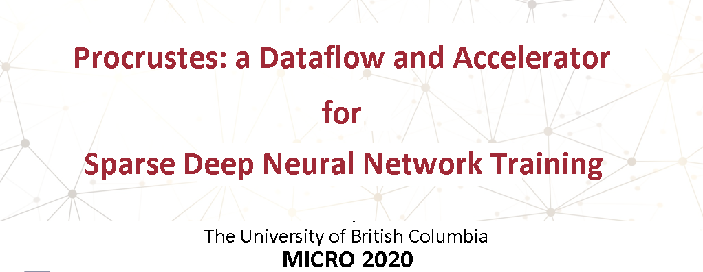

## Abstract
The success of DNN pruning has led to the development of energy-efficient inference accelerators that support pruned models with sparse weight and activation tensors.
 Because the memory layouts and dataflows in these architectures are optimized for the access patterns during inference, however, they do not efficiently support the emerging sparse training techniques.

In this work, we demonstrate a)that accelerating sparse training requires a co-design approach where algorithms are adapted to suit the constraints of hardware, and b) that hardware for sparse DNN training must tackle constraints that do not arise in inference accelerators.
 As proof of concept, we adapt a sparse training algorithm to be amenable to hardware acceleration; we then develop dataflow, data layout, and load-balancing techniques to accelerate it.

The resulting system is a sparse DNN training accelerator that produces pruned models with the same accuracy as dense models without first training, then pruning, and finally retraining, a dense model.
 Compared to training the equivalent unpruned models using a state-of-the-art DNN accelerator without sparse training support, Procrustes consumes up to 3.26x less energy and offers up to 4x speedup across a range of models, while pruning weights by an order of magnitude and maintaining unpruned accuracy.

<!---
 | Table of Contents |  |
 |-------------------|--|
 | Details TBD       |  |
--->

# Procrustes Architecture Simulation

## Running
For details on how to use the simulator, please see the [user guide](user-guide.md)

## Acknowledgement
This is a variation of the original [timeloop simulator](https://github.com/NVlabs/timeloop) that searches the optimal mapping for *dense* simulators. We extended it to support *sparse training* accelerators.
